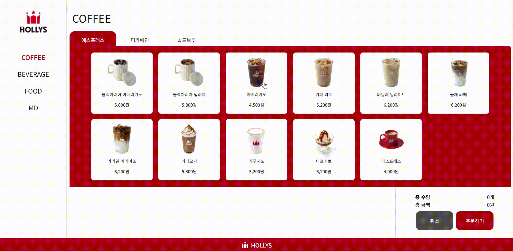

# 🥤 HOLLYS KIOSK

## 📢 About
📆 제작 기간 : 2024.07.03 ~ 2024.07.13  
👤 제작 인원 : 1명

## ⚙️ Tools
- html
- css
- javascript

## 🍀 Concept
할리스의 포인트 컬러를 활용하여 키오스크 화면을 구현하였습니다. 

## 💡 기능 설명
- 키오스크에 있는 커피, 음료, 디저트, MD 등 제품의 정보를 `axios`를 활용하여 불러드렸습니다.
- 제품 정보에 대해 클론된 리스트 항목을 생성하고, 사용자가 제품을 클릭할 때 선택한 제품을 주문 목록에 추가하는 기능을 구현하였습니다.
- 취소 버튼을 눌렀을 때는 메뉴 선택 목록과 총 수량/금액을 초기화되도록 하였고, 주문 버튼을 눌렀을 때는 다음 단계로 넘어갈 수 있도록 하였습니다.
- 지불 금액 선택 버튼을 이용하여 거스름돈을 계산할 수 있도록 구현하였으며, 결제하기 버튼을 눌렀을 때 지불 금액에 따른 alert와 confirm 창이 나타나도록 하였습니다.
  
## ☠️ 어려웠던 점

 
## 🌈 소감
처음으로 디자인부터 코딩까지 모두 혼자 해내는 과정에서 힘든 시간도 있었고 헤매기도 했습니다.
완성된 웹 페이지를 보게 되었을 때 미흡한 부분도 있어 아쉬움이 있었지만, 그럼에도 불구하고 큰 성취감을 느꼈습니다. 이를 통해 앞으로 더 나은 결과물을 만들기 위해 더욱 노력하겠다는 다짐을 하게 되었습니다.
